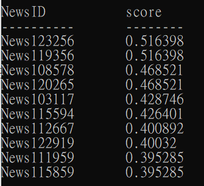

# readme
執行 
'''python project1.py'''

要執行此程式直接打以上指令即可。執行後會回傳retrieve的 NewsID 及其 score，如下圖：

在這邊四個combination及第二題的feedback都會跑出結果。

explanation:
主要可以調整的function有兩個：

- function 1:

**VectorSpace(documents, vectormode)** : 可以創造vector space，在vectormode中可以調整是創造’tf’還是’tf-idf’的vector space。

- function 2:

**printresult(query, files, n, mode):** 可以印出結果
共有四個變數，query已設定為["Trump Biden Taiwan China"]；files則為documents的檔案名稱；n可以選擇要印出前n個結果；mode則為調整計算score時是使用cosine similarity 還是 euclidean distance，在這邊用’cos’或’eucli’ 調整mode。

